# Introduction To Animation and Robotics – Assignment 2: Soft Body Simulation

**Name:** Amjad Abd El Rahim

**ID:** 207570227

---

## Task 1: Create a mesh for the simulation

The first step is to generate a mesh to use with the solver. We leverage the `triangle` library to triangulate arbitrary polygonal boundaries.

### Task 1.1 – Creative Shape

**Objective:** Create a custom polygon (e.g. a star) and triangulate its interior.
**Approach:** Define alternating outer and inner radii for boundary points, set up segments, and call `triangle.triangulate` with quality flags to produce a well-shaped mesh.

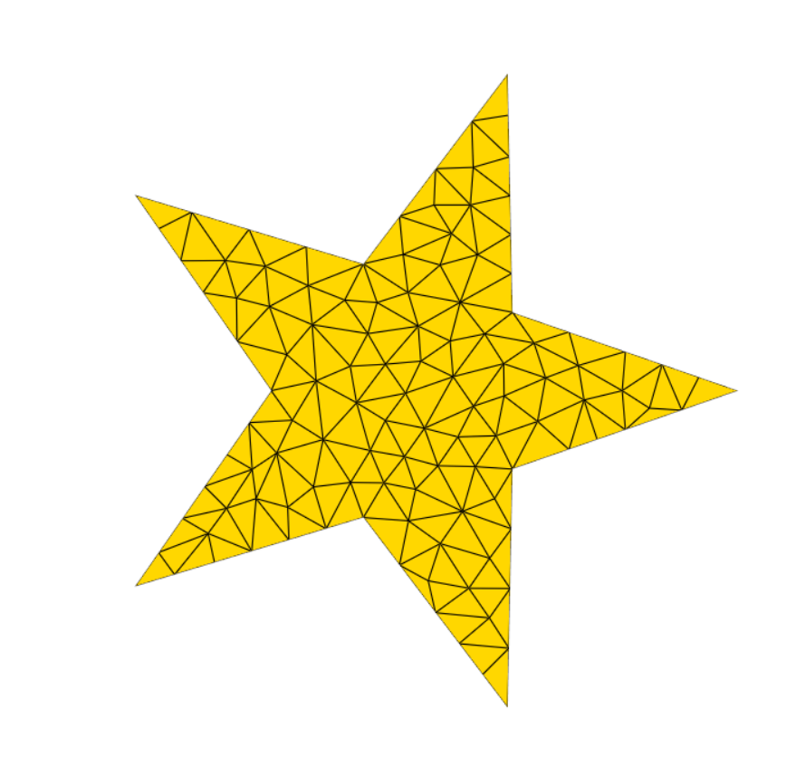

### Task 1.2 – Circle Boundary Triangulation

**Objective:** Generate a triangulation of the unit circle boundary using approximately 100 points, with no Steiner (interior) vertices added.
**Approach:** Sample about 100 uniformly spaced points on the circle, build a PSLG, and use Triangle’s `pzS` flags (`p`: PSLG, `z`: zero-based indexing, `S`: no Steiner points).

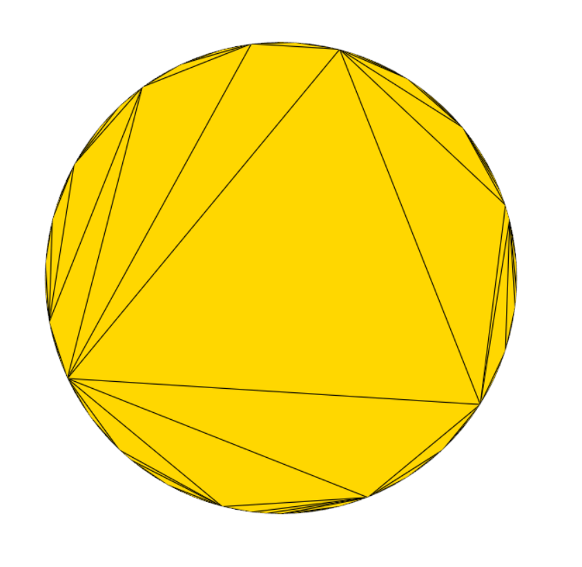

## Task 2: Implement Basic UI for Moving Points

To enable interactive control over the soft-body mesh, we add a simple UI for pinning and repositioning vertices using mouse and keyboard inputs.

### 2.1 Print Feedback in Vedo Window

**Objective:** Redirect debug output so that click events and messages appear directly in the Vedo window rather than the Python console.
**Approach:** Use `vedo.Text2D` or on-screen status labels to display messages whenever the user clicks or performs an action.

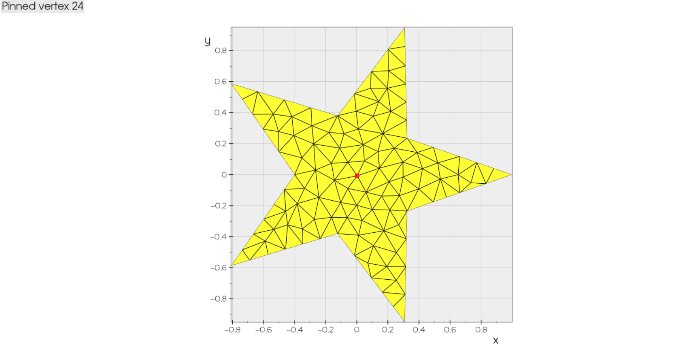

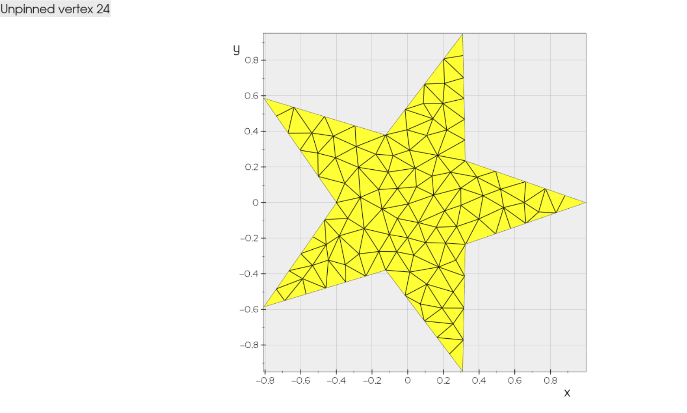


### 2.2 Pin and Move Vertices

**Objective:** Let the user pin selected vertices and drag them to new positions.
**Approach:**

* **Pinning:** left mouse click on a mesh vertex to toggle its pinned state.
* **Moving:** With a vertex pinned, drag (left-click and hold) to reposition it in the current view plane.
* **Modifiers:** Use Ctrl+click to unpin, Alt+click to snap to grid, etc., for additional control.

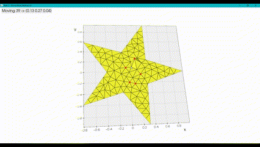

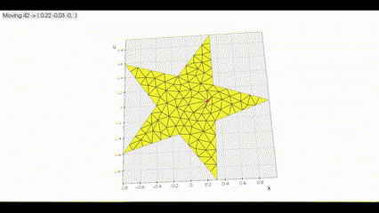

### 2.3 Toggle 2D/3D Edit Modes

**Objective:** Allow switching between 2D mode (editing in a fixed plane) and full 3D mode for repositioning vertices in space.
**Approach:**

* **Mode Toggle:** Press the `2 + 3` keys to switch modes.
* **2D Mode:** Click+drag moves vertices within the XY plane (z fixed).
* **3D Mode:** Click+drag along view normals to adjust depth (z) as well.

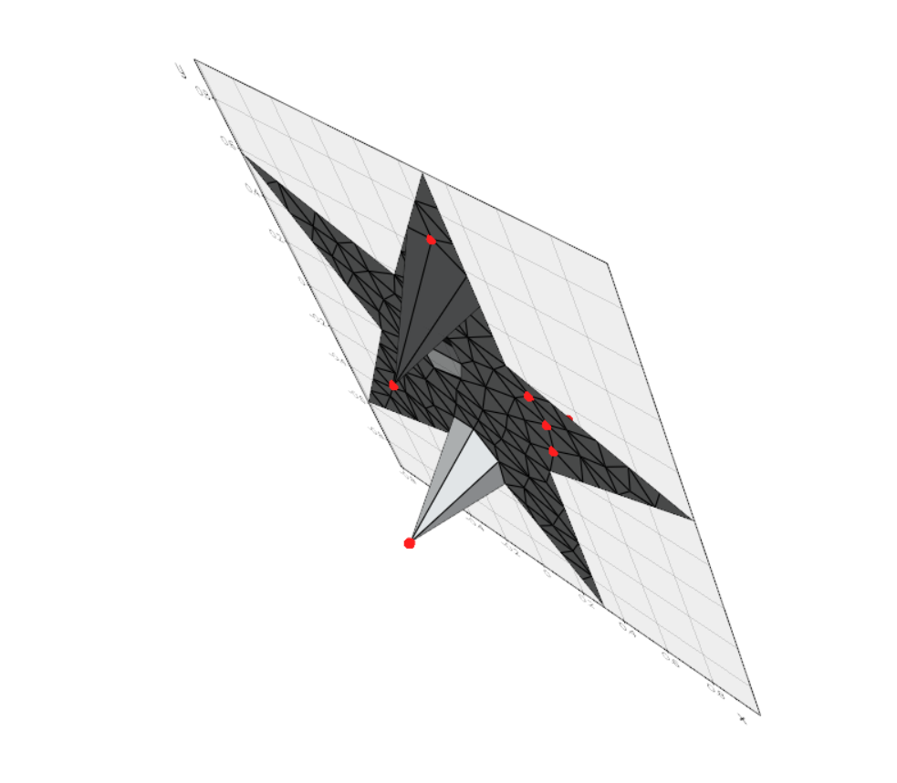

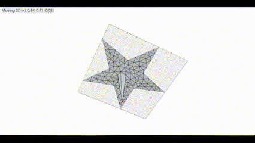


## Task 3: Energy Convergence

### 3.1 Zero‑Length Spring Energy

**Objective:** Visualize the total energy of the mesh under **Zero‑Length Spring Energy** over multiple iterations for both Gradient Descent and Newton’s Method.

**Results:**

**Gradient Descent**

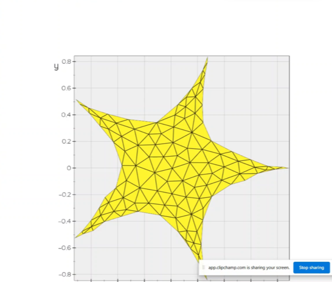

**Newton**

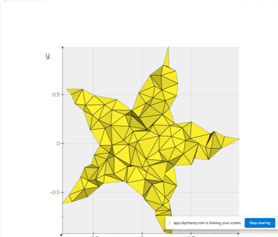


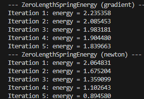


### 3.2 Hookean Spring Energy

**Objective:** Repeat the energy convergence test using **SpringEnergy** (standard Hookean springs). Since analytic gradients and Hessians are not provided, both are approximated via finite differences.

**Notes:**

* Finite‑difference step size chosen as $h=10^{-5}$.
* Gradient and Hessian approximations computed automatically each iteration.

**Results:**

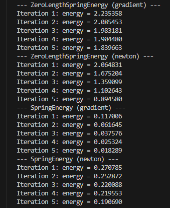


## Task 3.3: Soft Constraints via UI

**Objective:**
Enable interactive pinning of vertices (as in Task 2) and apply soft‐constraint energy to keep pinned vertices near target positions. Provide UI controls to adjust the penalty weight and observe how the mesh behavior changes.

**Approach:**

1. **Pinning Interface:** left click on mesh vertices to toggle pin state. Highlight pinned points with red markers.
2. **Weight Control:** Use `+` and `-` keys to increase/decrease the soft‐constraint weight . Display current weight on‐screen.
3. **Constraint Energy:** Add `SoftConstraintEnergy(base, pinned, targets, w)` atop the spring energy.
4. **Optimization Step:** On pressing `G` or `N`, perform a gradient or Newton step, respectively, using the current weight.

**Demonstrations:**

### Low Weight (e.g. w = 10)

* Constraint is weak → pinned vertices drift somewhat under spring forces.

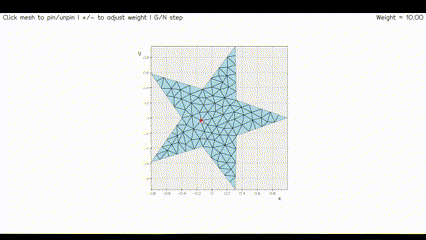

### High Weight (e.g. w = 1000)

* Constraint is strong → pinned vertices remain fixed, mesh deforms around them more sharply.

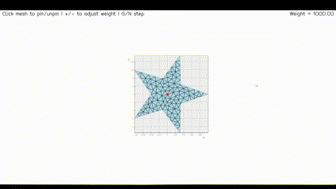

## Task 3.4: Analytical vs. Numerical Derivatives

**Objective:** Compare the performance and accuracy of the analytical gradient and Hessian implementations in `SpringEnergy` against numerical finite-difference approximations.

**Results:**

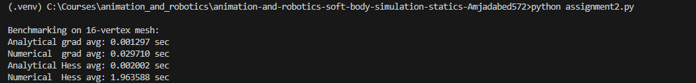

*Figure:* Runtime and error comparison between analytical and numerical (finite-difference) derivatives for `SpringEnergy`.


## Task 4: Ground Collision

## Task 4.1
**Objective:**
Allow the user to define a horizontal ground plane and implement an energy term that prevents mesh vertices from penetrating below this plane. Provide a UI control to adjust the collision penalty weight and observe its effect on the simulation.

**Approach:**

* Define the ground at a user-specified height `ground_z`.
* Introduce a **Ground Penalty Energy** term in code form:

```python
# For each vertex with z < ground_z:
E_ground = 0.5 * w_ground * (ground_z - z)**2
```

* Compute its gradient and Hessian in code form:

```python
# Gradient contribution for vertex i:
grad_z[i] += -w_ground * (ground_z - z[i])
# Hessian contribution for vertex i:
#   H[3*i+2, 3*i+2] += w_ground
```

* Integrate this `E_ground`, its gradient, and Hessian into the total energy stack.
* Allow `w_ground` to be adjusted at runtime via keyboard shortcuts or a slider.

**Demonstration:**

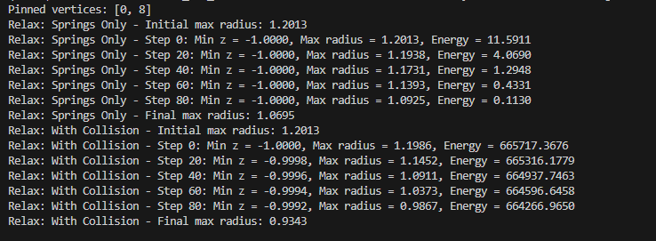

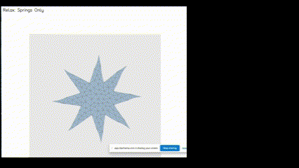

## Task 4.2

**Objective:**
Allow the user to add a spherical collider so that the mesh drapes over it without vertices penetrating the interior of the ball.

**Approach:**

* **Sphere Penalty Energy:** For each vertex at position $p_i$ and a ball centered at $c$ with radius $r$, define

  ```python
  E_ball = 0.5 * w_ball * max(0, r - ||p_i - c||)**2
  ```

  where $w_ball$ is a user–tunable weight.
* **Gradient:** For any vertex inside the sphere, apply a repulsive force:

  ```python
  if d < r:
      delta = r - d
      grad_i -= w_ball * delta * ((p_i - c) / d)
  ```
* **Integration:** Stack this energy on top of the existing pipeline:

  1. **SpringEnergy** (mesh elasticity)
  2. **SoftConstraintEnergy** (pinned vertices)
  3. **GravityEnergy**
  4. **SpherePenaltyEnergy** (ball collider)
  5. **MeshOptimizer** (gradient descent)

**Implementation Details:**

* The mesh is initially placed **above** the sphere (e.g., by raising all z‑coordinates by $+1$).
* The optimizer step simply subtracts `alpha * gradient` from the state vector.
* Tuning parameters:

  * Ball radius: `r = 0.6`
  * Penalty weight: `w_ball = 1e4`
  * Gravity: `g = 5.0`
  * Spring stiffness: `k = 10.0`
  * Step size: `alpha = 5e-4`

**Demonstration:**

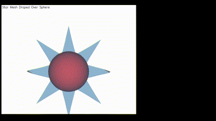 


